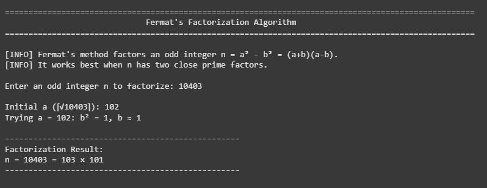
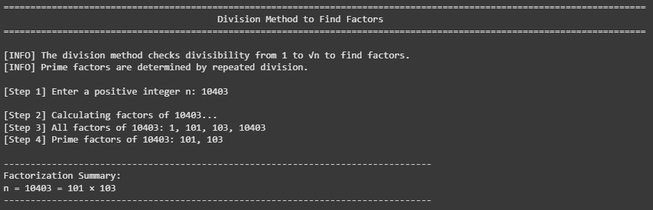

# **Cryptanalysis Toolkit: Fermat's and Division Factorization Algorithms**  

## **Overview**  
This repository contains two fundamental integer factorization algorithms:  
1. **Fermat's Factorization Method** (for numbers with close prime factors).  
2. **Division Method** (for general factorization and prime extraction).  

These algorithms are useful in cryptanalysis, number theory, and cybersecurity (e.g., breaking RSA for small/modest keys).  

---

## **1. Fermat's Factorization Algorithm**  
**Purpose**: Efficiently factorize an odd integer `n` into two close primes using the difference of squares.  

### **Algorithm Steps**  
1. Express `n` as `n = a² - b² = (a + b)(a - b)`.  
2. Start with `a = ⌈√n⌉` and increment until `a² - n` is a perfect square (`b²`).  
3. The factors are `(a + b)` and `(a - b)`.  

### **Image Reference**  
  

### **When to Use**  
- `n` is odd.  
- The two prime factors are close (e.g., RSA semiprimes with small key differences).  

---

## **2. Division Factorization Method**  
**Purpose**: Find all factors and prime factors of any positive integer `n` via trial division.  

### **Algorithm Steps**  
1. Iterate from `1` to `√n`, checking divisibility.  
2. For prime factors, divide `n` repeatedly by primes ≤ `√n`.  

### **Image Reference**  
  

### **When to Use**  
- General-purpose factorization.  
- Small to moderately large integers (not efficient for very large primes).  

---

**Author**: Abdul-Malik  
**Repository Link**: [GitHub](https://github.com/Abdul-Malik_Crypt-Analysis)  

--- 

**Note**: For very large numbers (>100 digits), consider advanced methods like Pollard’s Rho or Quadratic Sieve.
